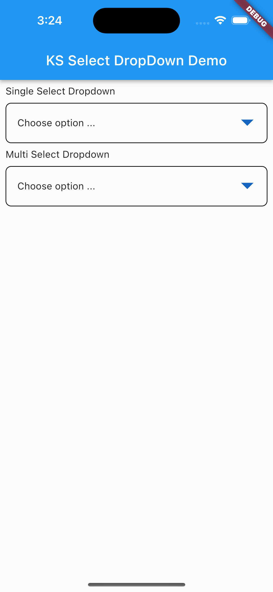
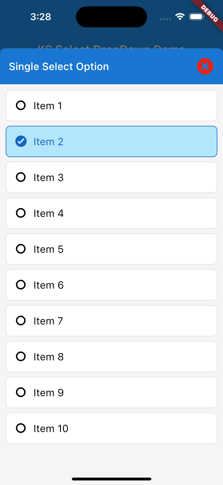
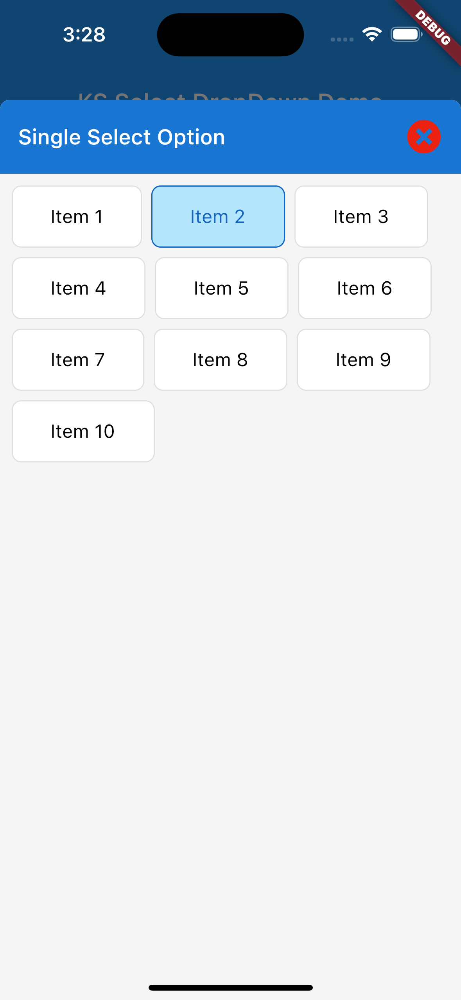
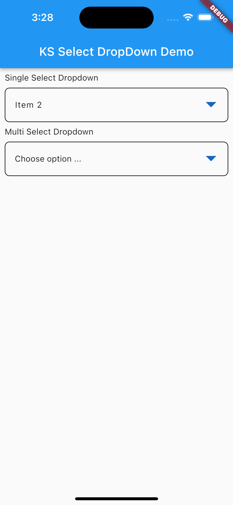
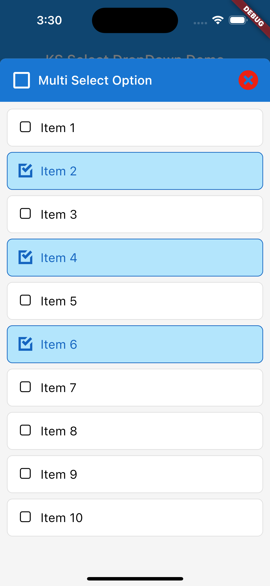
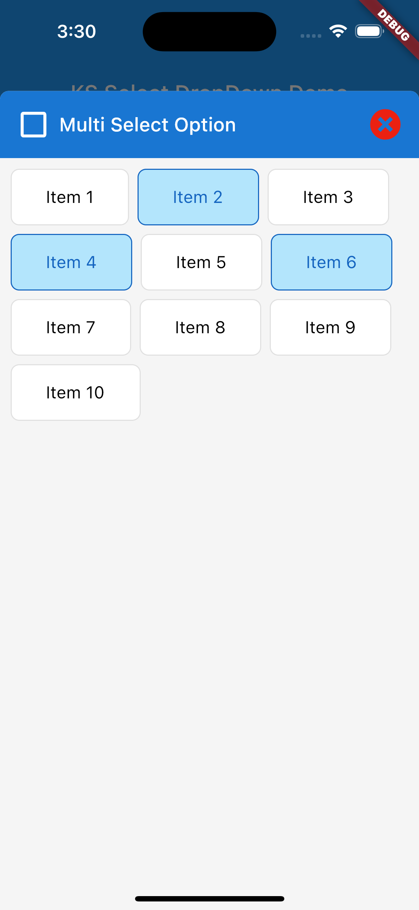
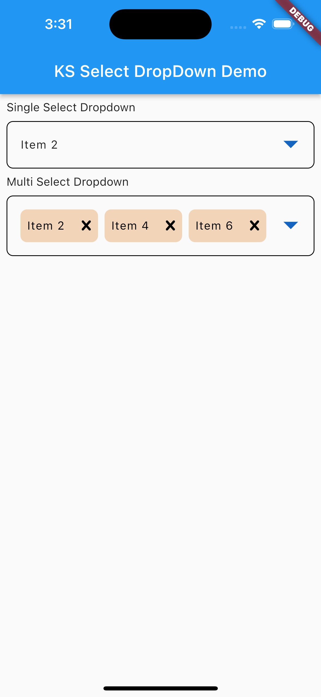

## A Flutter Dropdown widget for Mobile and iPad/Tablet which supports single and multiple select options

## Installation
### Add ks_select_dropdown to pubspec.yaml

```yaml
dependencies:
  ks_select_dropdown: ^0.0.1
```
## Usage

## Import the Package
```dart
import 'package:ks_select_dropdown/ks_select_dropdown.dart';
```

### Example

#### test_model.dart
```dart
import 'package:ks_select_dropdown/models/ks_dropdown_model.dart';
///
/// [TestModel] extends [KSDropDownModel]
/// in case your [Model] has different field name like this example
/// the [TestModel] description = [KSDropDownModel] name, etc
///
class TestModel extends KSDropDownModel {

  String? description;
  String? descriptionEn;

  TestModel({
    id,
    this.description,
    this.descriptionEn
  }) : super(
    id: id,
    name: description,
    nameEn: descriptionEn,
  );

}
```

#### main.dart
```dart
import 'package:flutter/material.dart';
import 'package:ks_select_dropdown/ks_select_dropdown.dart';
import 'test_model.dart';

void main() {
  runApp(const MyApp());
}

class MyApp extends StatelessWidget {
  const MyApp({super.key});

  // This widget is the root of your application.
  @override
  Widget build(BuildContext context) {
    return MaterialApp(
      title: 'KS Select DropDown Demo',
      theme: ThemeData(
        primarySwatch: Colors.blue,
      ),
      home: const MyHomePage(title: 'KS Select DropDown Demo'),
    );
  }
}

class MyHomePage extends StatefulWidget {
  const MyHomePage({super.key, required this.title});
  final String title;

  @override
  State<MyHomePage> createState() => _MyHomePageState();
}

class _MyHomePageState extends State<MyHomePage> {

  final List<TestModel> _dropdownItems = [];

  List<TestModel> _selectedItems = [];

  @override
  void initState() {
    WidgetsBinding.instance.addPostFrameCallback((timeStamp) { 
      _dropdownItems.addAll(
        List.generate(10, (index) => TestModel(id: index+1, description: 'Item ${index+1}', descriptionEn: 'Item ${index+1}'))
      );
      setState(() {});
    });
    super.initState();
  }

  @override
  Widget build(BuildContext context) {
    return Scaffold(
      appBar: AppBar(
        title: Text(widget.title),
      ),
      body: Padding(
        padding: const EdgeInsets.all(8.0),
        child: Column(
          crossAxisAlignment: CrossAxisAlignment.start,
          children: [
            
            ///
            ///*  [Single Select Dropdown]
            ///
            const Text('Single Select Dropdown'),
            const SizedBox(height: 8),
            KSSelectDropDownWidget(
              items: _dropdownItems, ///* DropDown List
              selectedItems: _selectedItems, ///* DropDown Selected Items
              // displayContentItem: (item) => yourLocalizeMethod(item), /// Based on your localize method
              getSelectedItem: (selectedItems) {
                setState(() {
                  /// get your selected items here
                  _selectedItems = selectedItems;
                });
              }, 
              label: 'Choose option ...',
              dropdownTitle: 'Single Select Option',
              // ksDropDownContentModeEnum: KSDropDownContentModeEnum.wrap, ///* Default: KSDropDownContentModeEnum.list
              // showSearch: true, ///* Default: showSearch = false
            ),

            const SizedBox(height: 8),

            ///
            ///*  [Multi Select Dropdown]
            ///
            const Text('Multi Select Dropdown'),
            const SizedBox(height: 8),
            KSSelectDropDownWidget(
              items: _dropdownItems, ///* DropDown List
              selectedItems: _selectedItems, ///* DropDown Selected Items
              // displayContentItem: (item) => yourLocalizeMethod(item), /// Based on your localize method
              getSelectedItem: (selectedItems) {
                setState(() {
                  /// get your selected items here
                  _selectedItems = selectedItems;
                });
              }, 
              label: 'Choose option ...',
              dropdownTitle: 'Multi Select Option',
              ksDropDownEnum: KSDropDownEnum.multiple,
              // ksDropDownContentModeEnum: KSDropDownContentModeEnum.wrap, ///* Default: KSDropDownContentModeEnum.list
              // showSearch: true, ///* Default: showSearch = false
            )
          ],
        ),
      ),
    );
  }

}

```

#### Example Screens


#### Example Single Select Screens




#### Example Multiple Select Screens




#### Example Screens with search

https://github.com/SowatKheang/ks_select_dropdown/assets/42835035/c47cefa8-1c0d-4d3c-9298-8a0a17eebb53

https://github.com/SowatKheang/ks_select_dropdown/assets/42835035/95504168-34d5-4e28-b19b-a9999ac24ce1

### Community Support

If you have any suggestions or issues, feel free to open an [issue](https://github.com/SowatKheang/ks_select_dropdown/issues)

If you would like to contribute, feel free to create a [PR](https://github.com/SowatKheang/ks_select_dropdown/pulls)
